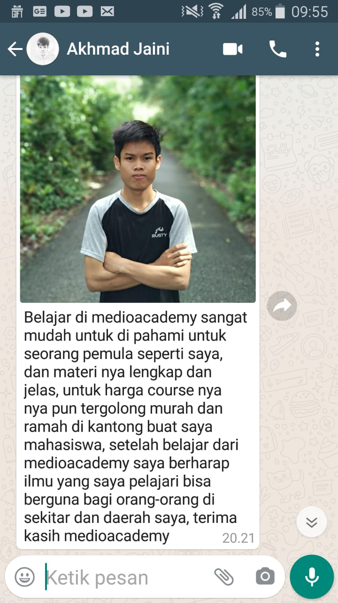
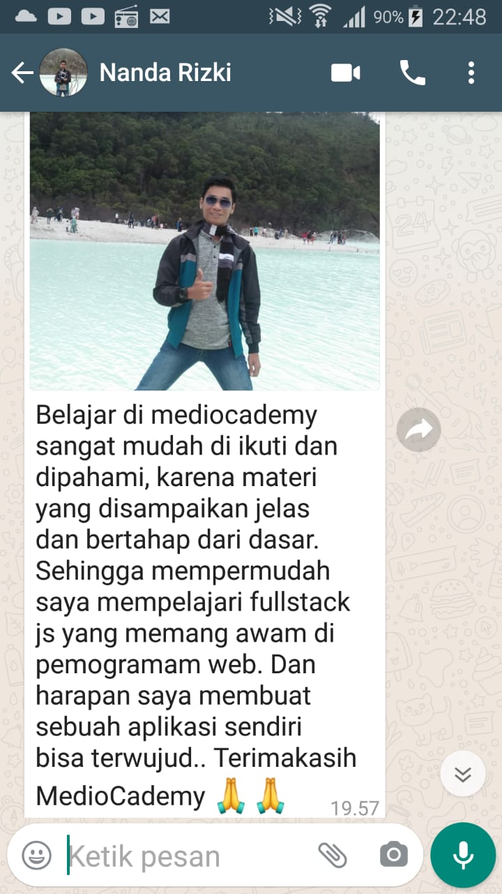
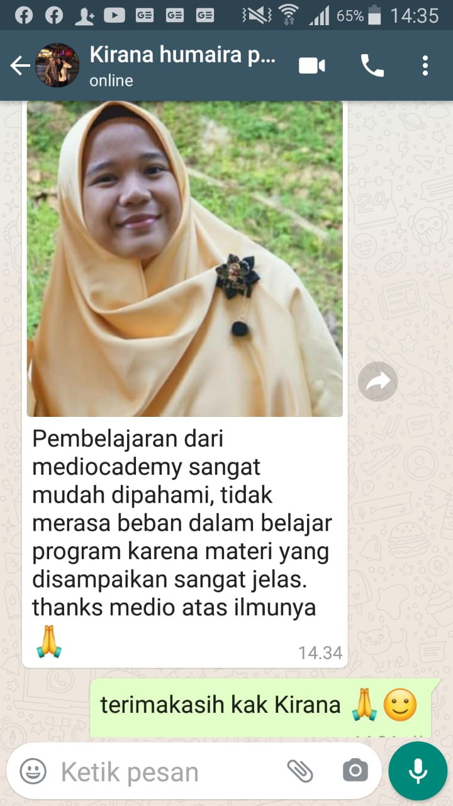
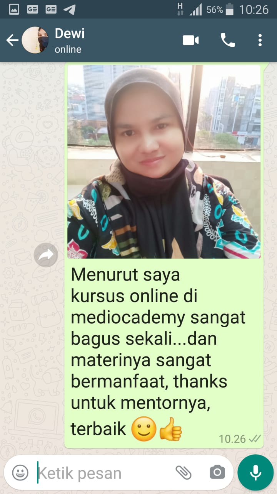

### SYARAT CLAIM eCERTIFICATE MedioCademy

1. Nama yang ingin di print di eCertificate : (Gelar, Title dsb) contoh: **Ir. Dr. Raden Mas Sigit Purnomo, SH, MSH.**

2. Nama kelas : contoh **Kelas Fullstack JavaScript Developer.**

3. Buka Youtube dan buka channel **mediocademy** kemudian **SUBSCRIBE** dan **LIKE** semua video dan silahkan **SHARE** ke teman dan saudara.

4. Buat **Nice & Positif Testimoni** tentang MedioCademy di WhatsApp (gunakan redaksi dan foto kalian masing-masing ) seperti contoh:

   

   

   

Bila sudah kami akan kirim kan eCertificate via email anda masing-masing.

Thanks

MedioCademy